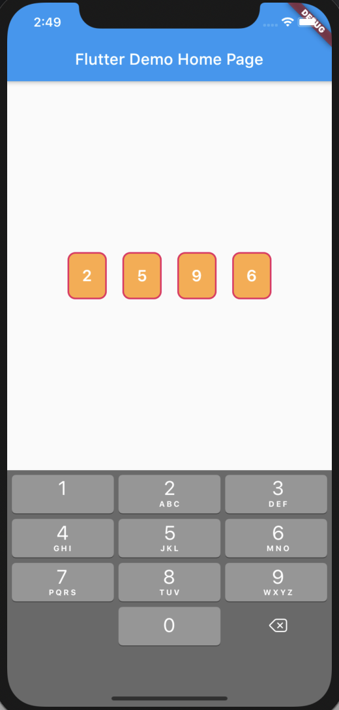
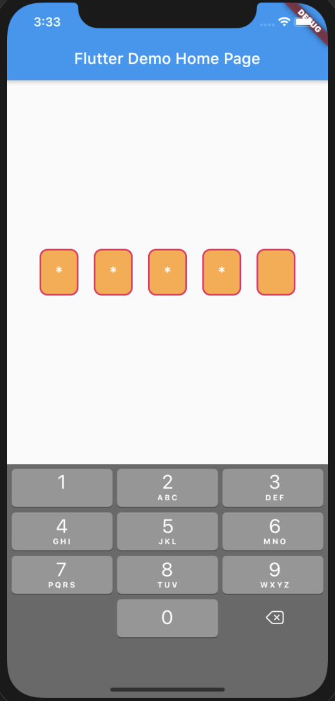
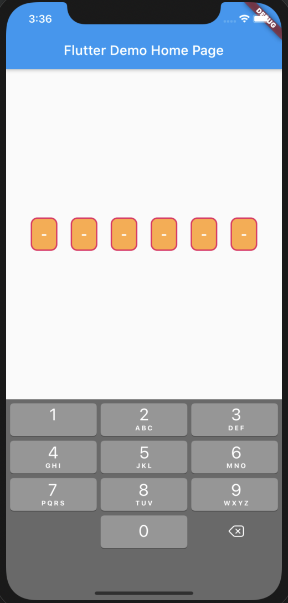

# pin_entry_field
Customized Pin Entry Text field for flutter.

# Example

```
PinEntryField(
    inputType: PinInputType.none | PinInputType.password | PinInputType.custom,
    pinInputCustom: "-", ///Only use for input type is PinInputType.custom
    onSubmit: (text) {
       print(text);
    },
    fieldCount: 4,
    fieldWidth: 50,
    height: 60,
    fieldStyle: PinEntryStyle(
       textStyle: TextStyle(
           color: Colors.white,
           fontSize: 20,
           fontWeight: FontWeight.w600
       ),
       fieldBackgroundColor: Colors.orangeAccent,
       fieldBorder: Border.all(
         color: Colors.pink,
         width: 2,
       ),
       fieldBorderRadius: BorderRadius.circular(10),
       fieldPadding: 20
    ),
)
```
## About PinInputType.none


## About PinInputType.password


## About PinInputType.custom
